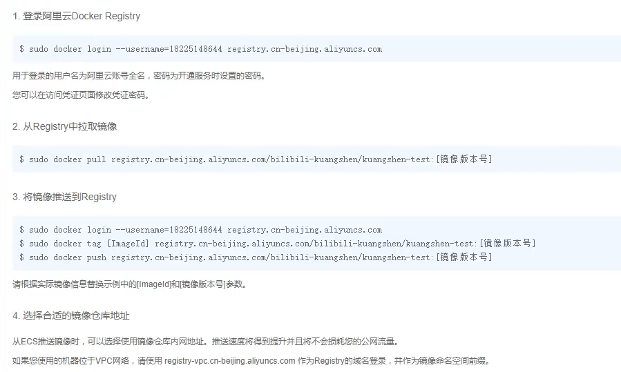
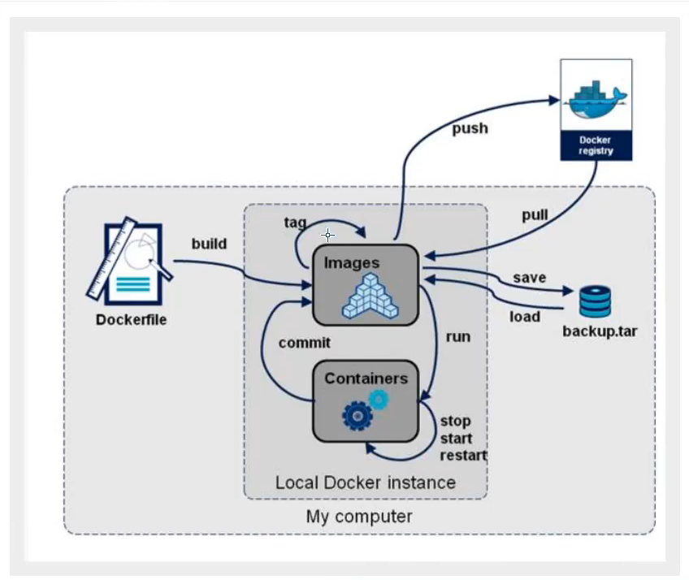
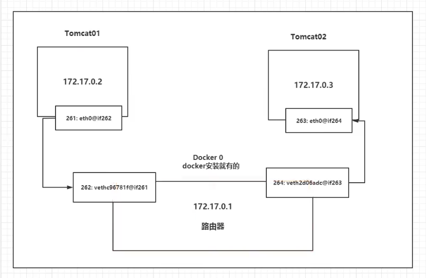

docker 学习笔记

# 只要学不死，就往死里学！！
- [只要学不死，就往死里学！！](#只要学不死就往死里学)
  - [Docker概述](#docker概述)
    - [Docker为什么出现？](#docker为什么出现)
    - [Docker 思想](#docker-思想)
    - [Docker 历史](#docker-历史)
    - [聊聊Docker](#聊聊docker)
    - [Docker 能干什么](#docker-能干什么)
      - [之前的虚拟机技术](#之前的虚拟机技术)
      - [容器化技术](#容器化技术)
    - [docker与传统虚拟机的不同](#docker与传统虚拟机的不同)
    - [DevOps（开发，运维）](#devops开发运维)
      - [应用更快速的交付和部署](#应用更快速的交付和部署)
      - [更便捷的升级和扩缩容](#更便捷的升级和扩缩容)
      - [更简单的系统运维](#更简单的系统运维)
      - [更高效的计算资源利用](#更高效的计算资源利用)
  - [docker安装](#docker安装)
    - [Docker的基本组成](#docker的基本组成)
    - [帮助文档](#帮助文档)
    - [阿里云镜像加速](#阿里云镜像加速)
  - [docker命令](#docker命令)
    - [docker是怎么工作的](#docker是怎么工作的)
    - [docker为什么比VM快](#docker为什么比vm快)
    - [常用命令](#常用命令)
      - [1.帮助命令](#1帮助命令)
      - [2.镜像命令](#2镜像命令)
      - [3.容器命令](#3容器命令)
      - [4.退出容器](#4退出容器)
      - [5.删除容器](#5删除容器)
      - [6.启动和停止容器](#6启动和停止容器)
    - [常用命令其他命令](#常用命令其他命令)
      - [后台启动容器](#后台启动容器)
      - [查看日志](#查看日志)
      - [查看容器中的进程信息](#查看容器中的进程信息)
      - [查看容器中元数据](#查看容器中元数据)
      - [进入当前正在运行的容器](#进入当前正在运行的容器)
      - [从容器内拷贝文件到主机上](#从容器内拷贝文件到主机上)
  - [docker镜像](#docker镜像)
    - [镜像是什么](#镜像是什么)
    - [Docker镜像加载原理](#docker镜像加载原理)
    - [UnionFS（联合文件系统）](#unionfs联合文件系统)
    - [分层理解](#分层理解)
    - [commit镜像](#commit镜像)
  - [容器数据卷](#容器数据卷)
    - [匿名挂载&具名挂载](#匿名挂载具名挂载)
    - [如何区分具名挂载、匿名挂载、指定容器挂载](#如何区分具名挂载匿名挂载指定容器挂载)
    - [dockerFile方式实现挂载文件](#dockerfile方式实现挂载文件)
    - [数据卷容器](#数据卷容器)
  - [dockerFile](#dockerfile)
    - [docekrFile介绍](#docekrfile介绍)
    - [dockerFile构建过程](#dockerfile构建过程)
      - [基础知识](#基础知识)
      - [DockerFile的指令](#dockerfile的指令)
    - [实战测试](#实战测试)
    - [CMD和ENTRYPOINT的区别](#cmd和entrypoint的区别)
    - [实战：Tomcate实战](#实战tomcate实战)
    - [发布自己的镜像](#发布自己的镜像)
    - [发布到阿里云镜像服务上](#发布到阿里云镜像服务上)
    - [小结](#小结)
  - [docker网络原理](#docker网络原理)
    - [理解docker0](#理解docker0)
      - [原理](#原理)
      - [总结](#总结)
    - [--link （不建议使用）](#--link-不建议使用)
    - [自定义网络](#自定义网络)
    - [网络联通（不同的网络）](#网络联通不同的网络)
  - [IDEA整合docker](#idea整合docker)
  - [docker Compose](#docker-compose)
  - [dockerSwarm（简化版k8s）](#dockerswarm简化版k8s)
## Docker概述
### Docker为什么出现？
1. 开发-上线俩套环境！ 应用环境，配置
2. 开发人员，运维人员
3. 版本更新导致服务不可用
4. 环境配置十分的麻烦，每一个机器都要部署环境（集群redis，es）！费时费力
5. 项目带上环境进行安装打包。
6. 环境不能跨平台
7. 开发使用Windows 最后发布到Linux 
### Docker 思想
docker 中心思想源于它的logo
1. 隔离：集装箱 例如之前多个项目之间会有冲突，eg 端口冲突，版本冲突等等。
2. docker 可以将服务器利用到极致
3. 最后docker解决了这些问题 将环境和代码同时打包成镜像
### Docker 历史
2010年IT年轻人在美国成立了一家公司叫 dotCloud 做一些pass的云计算服务 Linux 的容器技术。 

2013年开源 火了 
2014年4月9日 Docker1.0 发布
Docker为
### 聊聊Docker
docker 是基于go语言开发 

官网：https://www.docker.com 

docker 文档非常详细  

仓库地址 https://www.docker.hub.com
### Docker 能干什么
#### 之前的虚拟机技术
   缺点
   1. 资源占用多
   2. 冗余步骤多
   3. 启动慢
#### 容器化技术
- 容器化技术不是完整的模拟一个完整的操作系统
### docker与传统虚拟机的不同
1. 传统的虚拟机，虚拟出一套完整的硬件，运行一个完整的操作系统，然后在这个系统上安装和运行软件
2. 容器内应用直接运行在宿主机额内容，容器是没有自己的内核的，也没有虚拟我们的硬件，所有就轻便了
3. 每个容器间是互相隔离的，每个容器都一个属于自己的文件系统，互不影响

### DevOps（开发，运维）
#### 应用更快速的交付和部署
传统：一堆帮助文档，安装程序
Docker：一键运行
#### 更便捷的升级和扩缩容
使用了Docker之后，部署应用就和搭积木一样
项目打包成一个镜像，一键扩展
#### 更简单的系统运维
在容器化之后，开发和测试环境都是高度一致 
#### 更高效的计算资源利用
Docker 是内核级别的虚拟化，可以在物理机上可以运行多个运行实例

## docker安装 
### Docker的基本组成  
1. 镜像（image）
   docekr镜像就好比一个模板，可以通过这个模板来创建容器服务。
2. 容器（container）
    docker利用容器技术，独立运行一个或者一组应用，通过镜像来创建
3. 仓库（repository）
   仓库就是存放镜像的地方
   仓库分为共有仓库和私有仓库
   官方的Docker Hub
   阿里云
   配置镜像加速
### 帮助文档
```shell
# 1.卸载旧版本
$ sudo yum remove docker \
                  docker-client \
                  docker-client-latest \
                  docker-common \
                  docker-latest \
                  docker-latest-logrotate \
                  docker-logrotate \
                  docker-engine 

# 2.需要的安装包
$ sudo yum install -y yum-utils

# 3.设置镜像仓库
$ sudo yum-config-manager \
    --add-repo \
    https://download.docker.com/linux/centos/docker-ce.repo #默认的是国外的
    修改为阿里云的国内镜像仓库或者配置yum源

# 4.安装docker相关的内容
# 更新yum软件包索引
# docker-ce 社区版 ee 企业版
$ sudo yum install docker-ce docker-ce-cli containerd.io

# 5.启动docker
$ sudo systemctl start docker

# 6.测试docker
$ docker version
$ sudo docker run hello-world

# 7. 查看下载的hello-world镜像
$ sudo docker images
PS C:\WINDOWS\system32> docker images
REPOSITORY    TAG       IMAGE ID       CREATED         SIZE
hello-world   latest    bf756fb1ae65   11 months ago   13.3kB

# 8. 卸载docker
$ sudo yum remove docker-ce docker-ce-cli containerd.io
$ sudo rm -rf /var/lib/docker
```
### 阿里云镜像加速
1. 登录阿里云
2. 找到镜像加速的位置
3. 有镜像加速器
4. 执行命令
   ```shell
   sudo mkider -p /etc/docker

   sudo tee /etc/docker/daemon.json<<-'EOF'
   {
       "registry-mirrors":["https://qiyb99977.mirror.aliyuncs.com"]
   }
   EOF
   sudo systemctl daemon-reload
   sudo systemctl restart docker
   ```
## docker命令 
### docker是怎么工作的
docker是一个CS 架构的系统。通过Socket从客户端访问。
DockerServer接收到Docker-Clint的指令，就会执行这个命令。
### docker为什么比VM快
1. docker有着比虚拟机更少的抽象层
2. docker利用的是宿主的内核，VM需要的是GuestOS
新建一个容器的时候，docker不需要像虚拟机一样重新加载一个操作系统内核，避免引导，虚拟机是加载GuestOS，分钟级别的。虚拟机是硬件虚拟化。而docker是利用宿主主机的操作系统，省略了这个复杂的过程。
### 常用命令
#### 1.帮助命令
```bash
   docker version #显示docker的版本信息
   docker info #详细信息 系统信息
   docker 命令 --help #万能命令
```
#### 2.镜像命令
```bash
docker images #查看镜像信息

PS C:\WINDOWS\system32> docker images
REPOSITORY    TAG       IMAGE ID       CREATED         SIZE
hello-world   latest    bf756fb1ae65   11 months ago   13.3kB
# 解释
REPOSITORY 镜像的仓库源
TAG 镜像的标签
IMAGE ID 镜像的ID
CREATED 创建时间
SIZE 大小
Options:
  -a, --all             Show all images (default hides intermediate images)
      --digests         Show digests
  -f, --filter filter   Filter output based on conditions provided
      --format string   Pretty-print images using a Go template
      --no-trunc        Don't truncate output
  -q, --quiet           Only show image IDs 

  
  docker search mysql #搜索镜像
  Options:
  -f, --filter filter   Filter output based on conditions provided
      --format string   Pretty-print search using a Go template
      --limit int       Max number of search results (default 25)
      --no-trunc        Don't truncate output
PS C:\WINDOWS\system32> docker search mysql --filter=STARS=3000
NAME      DESCRIPTION                                     STARS     OFFICIAL   AUTOMATED
mysql     MySQL is a widely used, open-source relation…   10312     [OK]
mariadb   MariaDB is a community-developed fork of MyS…   3822      [OK]

#精髓
docker pull #下载镜像

PS C:\WINDOWS\system32> docker pull mysql
Using default tag: latest #如果不写tag，默认就是lastes
latest: Pulling from library/mysql
6ec7b7d162b2: Pull complete #分层下载，docker image 的核心 联合文件系统
6ec7b7d162b2: Pull complete
6ec7b7d162b2: Pull complete
6ec7b7d162b2: Pull complete
Digest: sha256:78800e6d3f1b230e35275145e657b82c3fb02a27b2d8e76aac2f5e90c1c30873 #签名
Status: Downloaded newer image for mysql:latest
docker.io/library/mysql:latest #真实地址


docker rmi # 删除镜像 可通过name 和 image id
docker rmi -f $(docker images -aq) #递归删除全部镜像
```
#### 3.容器命令
```bash
# 新建容器并启动
docker run [可选参数] image
# 参数说明
--name="NAME" # 容器名字 同来区分容器
-d # 后台方式运行
-it # 使用交互的方式运行，进入容器查看内容
-p # 指定容器的端口 -p 8080:8080
  1. -p ip:主机端口:容器端口
  2. -p 主机端口：容器端口
  3. -p 容器端口
  4. 容器端口
-p # 随机指定端口

docker run -it [容器NAME] /bin/bash # 启动并进入容器

exit # 从容器中退出到主机

docker ps # 查看当前正在运行的容器
docker ps -a # 列出当前正在运行的容器，带出历史运行过的容器
docker ps -n
```
#### 4.退出容器
```bash
exit # 直接退出容器并退出
Ctrl + Q + P #容器不停止并退出
```
#### 5.删除容器
```bash
docker rm 容器id # 删除所有容器 不能删除正在运行的容器 如果强制删除的使用 rm -f
docker rm -f $(docekr ps -aq) # 删除所有容器
docker ps -a -q|xargs docker rm # 删除所有容器
```
#### 6.启动和停止容器
```bash
docker start 容器id # 启动容器 
docker restart # 重启容器
docker stop # 停止容器
docker kill # 强制停止容器
```
### 常用命令其他命令
#### 后台启动容器
```bash
docker run -d 镜像名 # 启动容器 
```
#### 查看日志
```bash
docker logs 容器id# 查看日志 
docker run --name="test-nginx"  -d nginx /bin/sh -c "while true;do echo duan;sleep 1;done" # 自己编写shell脚本 测试日志
docker logs -tf --tail 10 a07511fd425b # 显示指定行日志
```
#### 查看容器中的进程信息
```bash
docker top 镜像id 
```
#### 查看容器中元数据
```bash
docker inspect 镜像id
```
#### 进入当前正在运行的容器
```bash
# 我们容器通常都是使用后台方式运行的，需要进入容器，修改一些配置
# 命令1
docker exec -it a07511fd425b /bash
# 命令2
docker attach 容器id
```
#### 从容器内拷贝文件到主机上
```bash
docker cp 0754eec7b305:/home/test.java ./  
```
## docker镜像 
### 镜像是什么
镜像是一个轻量级的可执行的独立软件包，用来打包软件运行环境和基于运行环境开发的软件，它包含运行某个软件所需的所有内容，包括代码，运行时，库，环境变量和配置文件。
所有的应用，直接打包docker镜像，就可以直接跑起来。
如何得到镜像
1. 从远程仓库下载
2. 朋友copy给你
3. 自己制作一个镜像DockerFile
### Docker镜像加载原理
### UnionFS（联合文件系统）
### 分层理解
分层下载 重复复用
### commit镜像
```bash
docker commit # 提交容器成为一个新的副本
docker commit -m="描述信息" -a="作者" 容器id 目标镜像名 tag
# docker 镜像上传到 Docker Hub 仓库
docker commit -a "duanzhigang" -m "nginx test" 352ea94c14be dzg_nginx:v1

参数说明:
-a :提交的镜像作者；

-c :使用Dockerfile指令来创建镜像；

-m :提交时的说明文字；

-p :在commit时，将容器暂停

 2.将docker 镜像上传到Docker Hub
docker push duanzhigang/dzg_nginx:v1
```
## 容器数据卷 
### 匿名挂载&具名挂载
```bash
# 匿名挂载
-v 容器内地址
-P 随机指定端口
docker run -d -P --name nginx01 -v /etc/nginx nginx

# 查看所有的 volume 的情况
docker volume ls
# -v 没有指定容器外路径只指定了内部容器地址

# 具名挂载
#查看卷位置 没有指定目录的情况下  没有指定目录的情况下都在 /var/lib/docker/volumes/xxxx/_data
#通过具名挂载可以方便找到卷的位置
PS C:\Windows\system32> docker volume inspect juming-nginx
[
    {
        "CreatedAt": "2021-01-04T02:05:53Z",
        "Driver": "local",
        "Labels": null,
        "Mountpoint": "/var/lib/docker/volumes/juming-nginx/_data",
        "Name": "juming-nginx",
        "Options": null,
        "Scope": "local"
    }
]
```
### 如何区分具名挂载、匿名挂载、指定容器挂载
```bash
-v 容器内路径             # 匿名挂载
-v 卷名:容器内路径        # 具名挂载
-v /宿主机路径:容器内路径 # 指定路径挂载

# 拓展
docker run -d -P --name nginx01 -v juming-nginx:/etc/nginx:ro nginx
docker run -d -P --name nginx01 -v juming-nginx:/etc/nginx:rw nginx

ro read only  # 只读 只能通过宿主机操作，不同通过容器内修改
rw read write # 可读可写
# 一旦设置了容器权限，容器对我们挂载的内容就有限定。
```
### dockerFile方式实现挂载文件
DockerFile 就是用来构建Docker镜像的构建文件。命令脚本,通过这个脚本生成一个脚本。
镜像是一层一层的，脚本是一个个的命令，每个命令都是一层。

```bash
# 创建一个dockerFile，名字可以随机，建议使用Dockerfile
# 文件中的内容 指令（大写） 参数
FROM centos

VOLUME ["volume01","volume02"]

CMD echo "------end----"

CMD /bin/bash

# 这里每个命令都是镜像的一层

# 执行dockerFile文件
docker build -f dockerfile1 -t dzg/centos:1.0 .

root@DESKTOP-55LGOP2:/home/docker-test-volume# docker build -f dockerfile1 -t dzg/centos:1.0 .
Sending build context to Docker daemon  2.048kB
Step 1/4 : FROM centos
latest: Pulling from library/centos
7a0437f04f83: Pull complete
Digest: sha256:5528e8b1b1719d34604c87e11dcd1c0a20bedf46e83b5632cdeac91b8c04efc1
Status: Downloaded newer image for centos:latest
 ---> 300e315adb2f
Step 2/4 : VOLUME ["volume01","volume02"]
 ---> Running in 0cc6fac12531
Removing intermediate container 0cc6fac12531
 ---> bfe48ab0dcc0
Step 3/4 : CMD echo "------end----"
 ---> Running in ef9e250886db
Removing intermediate container ef9e250886db
 ---> 6b45bba8d564
Step 4/4 : CMD /bin/bash
 ---> Running in ae165fe7fc76
Removing intermediate container ae165fe7fc76
 ---> bd1940211df9
Successfully built bd1940211df9
Successfully tagged dzg/centos:1.0

# 这种方式也可以实现卷挂载 如果构建时没有挂载卷，要手动镜像挂载 -v 卷名：容器内路径
```
### 数据卷容器
实现多个容器之间实现数据共享，利用父容器为其他容器实现数据共享
```bash
docker run -it --name docker01 dzg/centos:1.0
docker run -it --name docker02 --volumes-from docker01 dzg/centos:1.0 # 继承docker01的挂载目录
docker run -it --name docker03 dzg/centos:1.0

#删除父容器后数据不会丢失

#备份机制
多个mysql 实现数据共享
```
结论：
容器之间配置信息的传递，数据卷容器的生命周期一直持续到没有容器使用为止、
但是一旦持久化到本地，这个时候，本地的数据时不会删除的。
## dockerFile
### docekrFile介绍
dockerfile 是用来构建docker镜像的文件！命令参数脚本
构建步骤：
1. 编写一个dockerFile文件
2. docekr build 构建成为一个镜像
3. docker run 运行镜像
4. docker push 发布镜像（DockerHub）
查看官方是怎么做的？
官方的镜像都是基础包，很多功能没有，我们通常搭建自己的镜像。
官方既然可以制作镜像，我们也可以
### dockerFile构建过程
#### 基础知识
1. 每个保留关键字（指令）都必须是关键字
2. 按照从上到下的顺序执行
3. `#表示注释
4. 每一个指令都会创建提交一个新的镜像层，并提交
步骤：开发，部署，运维。。。
dockerFile 是面向开发的。以后我们要发布项目，做镜像，就需要编写dockerfile文件，这个文件非常简单。
Docker镜像逐渐成为了企业交付的标准
DockerFile:构建文件，定义了一切步骤，源代码
DockerFile：通过DockerFile构建生成的镜像，最终发布浩哥运行的产品。
Docker容器：容器就是镜像运行起来提供服务器。
#### DockerFile的指令
```bash
FROM         # 基础镜像，一切从这里开始构建
MAINTAINER   # 镜像是谁写的，姓名＋邮箱
RUN          # 镜像构建的时候需要运行的命令
ADD          # 步骤，tomcat镜像，这个tomcat压缩包，添加内容
WORKDIR      # 镜像的工作目录
VOLUME       # 挂载的目录
EXPOST       # 暴露端口配置
CMD          # 指定这个容器启动的时候要运行的命令,最后一个会生效，可以被替代
ENTRYPOINT   # 指定这个容器启动的时候要运行的命令，可以追加命令
ONBUILD      # 当构建一个被继承 dockerFile 这个时候就会运行指定
COPY         # 类似ADD，将文件拷贝到镜像中
ENV          # 构建的时候设置环境变量
```
### 实战测试
Docker Hub 中99%镜像都是从scratch这个基础镜像过来的，然后配置需要的软件和配置来进行构建
```shell
FROM scratch
ADD centos-7-x86_64-docker.tar.xz /

LABEL \
    org.label-schema.schema-version="1.0" \
    org.label-schema.name="CentOS Base Image" \
    org.label-schema.vendor="CentOS" \
    org.label-schema.license="GPLv2" \
    org.label-schema.build-date="20201113" \
    org.opencontainers.image.title="CentOS Base Image" \
    org.opencontainers.image.vendor="CentOS" \
    org.opencontainers.image.licenses="GPL-2.0-only" \
    org.opencontainers.image.created="2020-11-13 00:00:00+00:00"

CMD ["/bin/bash"]
```
创建一个自己的centOS
```bash
# 1. 编写DockerFile的文件
FROM centos

MAINTAINER dzg<duanzhigang@qq.com>

ENV MYPATH /user/local

WORKDIR $MYPATH

RUN yum -y install vim

RUN yum -y install net-tools

EXPOSE 80

CMD echo $MYPATH
CMD echo "-----end----"
CMD /bin/bash

# 2. 通过这个文件构建镜像
-f 指定dockerFile的文件
docker build -f mydockerfilse-centos  -t dzg/centos:1.0 .

Successfully built 2e47fa117f98
Successfully tagged dzg/centos:1.0

# 3. 测试运行
```
我们可以列出本地进行的变更历史
```bash
root@DESKTOP-55LGOP2:/home/dockerfile# docker history 2e47fa117f98
IMAGE          CREATED          CREATED BY                                      SIZE      COMMENT
2e47fa117f98   21 minutes ago   /bin/sh -c #(nop)  CMD ["/bin/sh" "-c" "/bin…   0B
0d612669d011   21 minutes ago   /bin/sh -c #(nop)  CMD ["/bin/sh" "-c" "echo…   0B
47c62e995bf8   21 minutes ago   /bin/sh -c #(nop)  CMD ["/bin/sh" "-c" "echo…   0B
8cb571b0f109   21 minutes ago   /bin/sh -c #(nop)  EXPOSE 80                    0B
453ea7d04090   21 minutes ago   /bin/sh -c yum -y install net-tools             23.4MB
ba6b30c3edd5   21 minutes ago   /bin/sh -c yum -y install vim                   58.1MB
ec8292da67bb   22 minutes ago   /bin/sh -c #(nop) WORKDIR /user/local           0B
d990e163d8eb   22 minutes ago   /bin/sh -c #(nop)  ENV MYPATH=/user/local       0B
b8ec647e5040   22 minutes ago   /bin/sh -c #(nop)  MAINTAINER dzg<duanzhigan…   0B
300e315adb2f   3 weeks ago      /bin/sh -c #(nop)  CMD ["/bin/bash"]            0B
<missing>      3 weeks ago      /bin/sh -c #(nop)  LABEL org.label-schema.sc…   0B
<missing>      3 weeks ago      /bin/sh -c #(nop) ADD file:bd7a2aed6ede423b7…   209MB
```
### CMD和ENTRYPOINT的区别
entrypoint 可以直接在后面加命令。
cmd 不可以会直接覆盖掉。
```bash
CMD          # 指定这个容器启动的时候要运行的命令,最后一个会生效，可以被替代
ENTRYPOINT   # 指定这个容器启动的时候要运行的命令，可以追加命令
```
### 实战：Tomcate实战
1. 准备镜像文件tomcat压缩包，jdk的压缩包
2. 编写DockerFile文件，官方默认指定DockerFile命名，在build的 -f 是会自动寻找DockerFile文件
```bash
FROM centos

MAINTAINER zhangshuai<lazycatzs@qq.com>

ADD jdk-8u221-linux-x64.tar.gz /usr/local

ADD apache-tomcat-8.5.57.tar.gz /usr/local

RUN yum -y install vim

ENV MYPATH /usr/local

WORKDIR $MYPATH

ENV JAVA_HOME /usr/local/jdk1.8.0_221

ENV CLASSPATH $JAVA_HOME/lib/dt.jar:$JAVA_HOME/lib/tools.jar

ENV PATH $PATH:$JAVA_HOME/bin

EXPOSE 8080

CMD  /usr/local/apache-tomcat-8.5.57/bin/startup.sh
```
3. 构建镜像
```bash
docker build -t diytomcat .
```
4. 启动镜像
5. 访问测试
6. 发布项目
### 发布自己的镜像
1. 注册自己的账号 https://registry.hub.docker.com/
2. 在我们服务器上提交自己的镜像
3. docker login
4. 登录完毕后可以提交镜像了
5. docker push duanzhignag/diytomcat:1.0
### 发布到阿里云镜像服务上
1. 登录阿里云
2. 找到容器镜像服务
3. 镜像仓库
4. 创建一个命名空间
5. 创建容器镜像
6. 浏览阿里云仓库


### 小结

## docker网络原理 
### 理解docker0
docker run -d -P --name tomcat01 tomcat 
ip addr 查看容器ip
发现容器启动的时候会得到一个eth0if262 IP地址，docker分配的

linux 可以ping通docker容器的IP
#### 原理
1. 我们每启动一个docker容器，docker会给docker容器分配一个IP，只要电脑上安装了docker，就会有一个docker0 桥接模式，使用的技术是evth-pair技术
evth-pair就是一堆的虚拟设备接口，它们都是成对出现的，一段连着协议，一段别此相连
正因为有这个特性，evth-pair充当一个桥梁，连接各种虚拟网络设备。
2. 我们测试发现tomcat01和tomcat02 之间是可以ping通的！！
3. 
#### 总结
tomcat01和tomcat02是公用的一个路由器，docker0
所有的容器不指定网络的情况下，都是docker0路由的，docker会给我们的容器分配一个默认的可用IP

255.255.0.1/16 域 局域网 
有255.255.0.0~255.255.255.255个地址 大约是65535~个
Docker使用的是Linux的桥接，宿主机中是一个Docker容器的网桥docker0
Docker中的所有的网络接口都是虚拟的，虚拟的转发效率高。
### --link （不建议使用）
思考一个场景，我们编写了一个微服务，database url=ip，项目不重启，数据库ip换掉了，我们希望可以处理这个问题，可以用名字访问容器吗？
```bash
docker run -d -P --name tomcat03 --link tomcat02 tomcat 

root@e66c5b8d7bd5:/usr/local/tomcat# ping tomcat02
PING tomcat02 (172.17.0.3) 56(84) bytes of data.
64 bytes from tomcat02 (172.17.0.3): icmp_seq=1 ttl=64 time=0.114 ms
64 bytes from tomcat02 (172.17.0.3): icmp_seq=2 ttl=64 time=0.083 ms
64 bytes from tomcat02 (172.17.0.3): icmp_seq=3 ttl=64 time=0.083 ms
```
配置地址在 容器内部的host文件中
```bash
root@e66c5b8d7bd5:/usr/local/tomcat# cat /etc/hosts
127.0.0.1       localhost
::1     localhost ip6-localhost ip6-loopback
fe00::0 ip6-localnet
ff00::0 ip6-mcastprefix
ff02::1 ip6-allnodes
ff02::2 ip6-allrouters
172.17.0.3      tomcat02 3c46d2d03c58
172.17.0.4      e66c5b8d7bd5
```
### 自定义网络
容器互联：
```bash
# 查看所有网络
PS C:\WINDOWS\system32> docker network ls                                                                                                                                                                               NETWORK ID     NAME      DRIVER    SCOPE
30d2ca3aee7e   bridge    bridge    local
171901efc09c   host      host      local
009832dbf1aa   none      null      local
```
网络模式
1. bridge：桥接模式
2. none：不配置网络
3. host：主机模式（和宿主机共享网络）
4. container：容器内网络联通
```bash
# 我们直接启动的命令会默认添加--net bridge参数
docker run  -d -P --name tomcat01 --net bridge tomcat 
#docker0特点： 默认，域名不能访问

#自定义网络
PS C:\WINDOWS\system32> docker network create --help
Usage:  docker network create [OPTIONS] NETWORK

Create a network

Options:
      --attachable           Enable manual container attachment
      --aux-address map      Auxiliary IPv4 or IPv6 addresses used by
                             Network driver (default map[])
      --config-from string   The network from which to copy the configuration
      --config-only          Create a configuration only network
  -d, --driver string        Driver to manage the Network (default "bridge")
      --gateway strings      IPv4 or IPv6 Gateway for the master subnet
      --ingress              Create swarm routing-mesh network
      --internal             Restrict external access to the network
      --ip-range strings     Allocate container ip from a sub-range
      --ipam-driver string   IP Address Management Driver (default "default")
      --ipam-opt map         Set IPAM driver specific options (default map[])
      --ipv6                 Enable IPv6 networking
      --label list           Set metadata on a network
  -o, --opt map              Set driver specific options (default map[])
      --scope string         Control the network is scope
      --subnet strings       Subnet in CIDR format that represents a
                             network segment

# --driver bridge 桥接
# --subnet 192.168.0.0/16 默认子网
# --gateway 192.168.1.1 网关
PS C:\WINDOWS\system32> docker network create --driver bridge --subnet 192.168.1.0/16 --gateway 192.168.1.1 mynet       29d13f4c45f958bd09bfed43a76d46db7841cf8bf1fdcccd1e05b193acd07c31
PS C:\WINDOWS\system32> docker network ls                                                                               NETWORK ID     NAME      DRIVER    SCOPE
30d2ca3aee7e   bridge    bridge    local
171901efc09c   host      host      local
29d13f4c45f9   mynet     bridge    local
009832dbf1aa   none      null      local

# 查看网络状态
PS C:\WINDOWS\system32>  docker network inspect mynet                                                                   [
    {
        "Name": "mynet",
        "Id": "29d13f4c45f958bd09bfed43a76d46db7841cf8bf1fdcccd1e05b193acd07c31",
        "Created": "2021-01-04T14:29:47.2823807Z",
        "Scope": "local",
        "Driver": "bridge",
        "EnableIPv6": false,
        "IPAM": {
            "Driver": "default",
            "Options": {},
            "Config": [
                {
                    "Subnet": "192.168.1.0/16",
                    "Gateway": "192.168.1.1"
                }
            ]
        },
        "Internal": false,
        "Attachable": false,
        "Ingress": false,
        "ConfigFrom": {
            "Network": ""
        },
        "ConfigOnly": false,
        "Containers": {},
        "Options": {},
        "Labels": {}
    }
]
# 配置自己的网络
PS C:\WINDOWS\system32> docker run -d -P --name tomcat01 --net mynet tomcat                                             cba194b6e06ad1be19e901d59a609257a9ab52bec43a63c87e07c510aeb6d45a
PS C:\WINDOWS\system32> docker run -d -P --name tomcat02 --net mynet tomcat                                             5823dba3c0f6fc15136af07961abf3e17036f1df5fe75cba5d0e6cc6e6f9e47d
PS C:\WINDOWS\system32> docker ps                                                                                       
CONTAINER ID   IMAGE     COMMAND             CREATED          STATUS         PORTS                     NAMES
5823dba3c0f6   tomcat    "catalina.sh run"   5 seconds ago    Up 3 seconds   0.0.0.0:55004->8080/tcp   tomcat02
cba194b6e06a   tomcat    "catalina.sh run"   10 seconds ago   Up 9 seconds   0.0.0.0:55003->8080/tcp   tomcat01
PS C:\WINDOWS\system32> docker network inspect mynet                                                                    [
    {
        "Name": "mynet",
        "Id": "29d13f4c45f958bd09bfed43a76d46db7841cf8bf1fdcccd1e05b193acd07c31",
        "Created": "2021-01-04T14:29:47.2823807Z",
        "Scope": "local",
        "Driver": "bridge",
        "EnableIPv6": false,
        "IPAM": {
            "Driver": "default",
            "Options": {},
            "Config": [
                {
                    "Subnet": "192.168.0.0/16",
                    "Gateway": "192.168.1.1"
                }
            ]
        },
        "Internal": false,
        "Attachable": false,
        "Ingress": false,
        "ConfigFrom": {
            "Network": ""
        },
        "ConfigOnly": false,
        "Containers": {
            "5823dba3c0f6fc15136af07961abf3e17036f1df5fe75cba5d0e6cc6e6f9e47d": {
                "Name": "tomcat02",
                "EndpointID": "757cc297abb5210c4d7d3509e64810b1aef8397fe5c2091fd40ed88e5e5aa643",
                "MacAddress": "02:42:c0:a8:00:02",
                "IPv4Address": "192.168.0.2/16",
                "IPv6Address": ""
            },
            "cba194b6e06ad1be19e901d59a609257a9ab52bec43a63c87e07c510aeb6d45a": {
                "Name": "tomcat01",
                "EndpointID": "a95071a0ba069231f6c994eabb084e731df5e2d7c9139021544a7d9045be9d20",
                "MacAddress": "02:42:c0:a8:00:01",
                "IPv4Address": "192.168.0.1/16",
                "IPv6Address": ""
            }
        },
        "Options": {},
        "Labels": {}
    }
]
# 连接成功
root@e1ea620921bc:/usr/local/tomcat# ping tomcat02
PING tomcat02 (192.168.0.2) 56(84) bytes of data.
64 bytes from e1ea620921bc (192.168.0.2): icmp_seq=1 ttl=64 time=0.055 ms
64 bytes from e1ea620921bc (192.168.0.2): icmp_seq=2 ttl=64 time=0.056 ms
64 bytes from e1ea620921bc (192.168.0.2): icmp_seq=3 ttl=64 time=0.056 ms
64 bytes from e1ea620921bc (192.168.0.2): icmp_seq=4 ttl=64 time=0.053 ms
```
我们自定义的网络docker都已经帮我们维护好了对应的关系，推荐使用这样使用网络

好处：不同的集群使用不同的网络

### 网络联通（不同的网络）
## IDEA整合docker 
## docker Compose 
## dockerSwarm（简化版k8s） 
#挂载目录并运行
```bash
docker run -d --name <iamgeName> -p 3030:80 -v E:/projectE/new_uplink_use_git/new_uplink_payment:/opt/usen/uplink/current wqcyber/new_uplink_php:v2
```